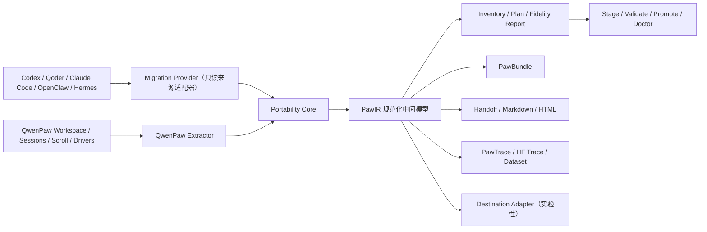
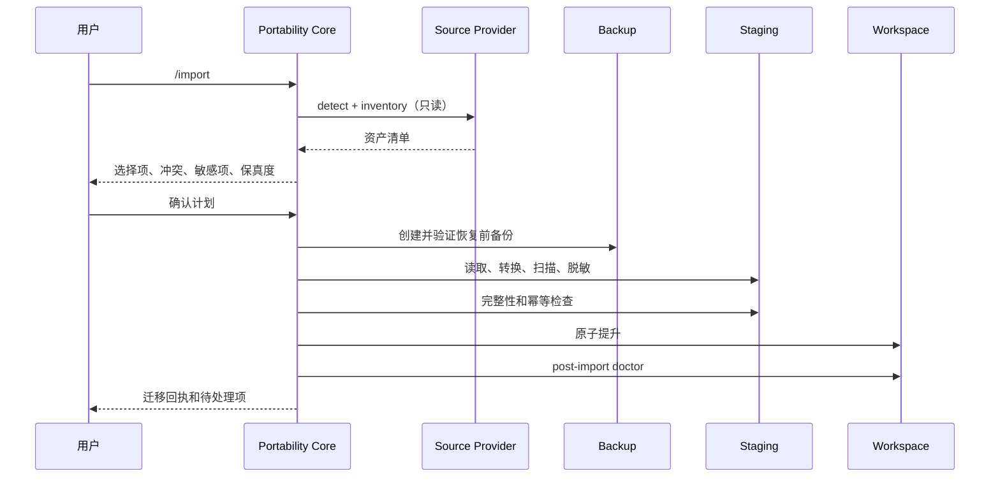

# PawPort：QwenPaw 智能体导入、导出与任务接力方案

> 文档状态：设计提案（Draft）
> 版本：0.1
> 更新日期：2026-08-11
> 面向读者：QwenPaw 产品、客户端、后端、运行时、安全与生态开发者

## 摘要

PawPort 是 QwenPaw 面向智能体数据可携带性设计的一层能力。它不把 `/import` 理解为“复制几个配置文件”，也不把 `/export` 理解为“把工作目录压成 ZIP”，而是解决四个连续但不同的问题：

1. **连接（Connect）**：在 QwenPaw 中继续使用 Codex、Qoder 等第三方 Agent Runtime；
2. **提升（Promote）**：把一个第三方 backend 智能体转换成 QwenPaw 原生智能体，之后可以脱离原 Runtime；
3. **接力（Handoff）**：把项目状态、会话上下文、决策和未完成工作组织成可继续执行的任务包；
4. **携带（Port）**：把配置、记忆、Skills、MCP、会话和轨迹导出为可验证、可脱敏、可转换的数据包。

QwenPaw 已经拥有 Harness Runtime、Workspace、Driver、Skill、Scroll、备份、治理与沙箱等基础。PawPort 的主要工作不是推倒重来，而是在这些模块之上增加统一的资产清单、转换计划、会话目录、规范化数据模型和安全事务层。

一句话概括：

> PawPort 让 QwenPaw 从“可以接入多个 Agent Runtime”，进一步成为“可以承接、治理和携带智能体资产与任务状态的 Agent OS”。

---

## 1. 背景与问题

用户更换 Agent Harness 时，真正希望保留的通常不只是模型配置，还包括：

- 项目目录及其 Git 状态；
- 用户级和项目级指令；
- Skills、命令、MCP 和工具策略；
- 长期记忆、项目记忆和阶段性总结；
- 历史会话、工具调用、工具结果和附件；
- 当前任务做到了哪里、为什么这样做、下一步做什么；
- 必要时可用于分析、评测或训练的数据轨迹。

这些数据分散在不同文件、数据库、Runtime 和账号边界里。直接复制目录有四类问题：

1. **语义不同**：同名的 permission、hook、skill、subagent 在不同 Harness 中含义不一定相同；
2. **安全边界不同**：配置中可能包含 token、cookie、密码、宽泛权限或可执行脚本；
3. **会话状态不同**：模型上下文、工具 ID、压缩状态和隐藏 Runtime 状态无法逐位恢复；
4. **目标持续变化**：为每对 Harness 编写转换器，会快速形成 N×M 的维护成本。

因此，本方案追求的是：

> 可解释的语义迁移、可验证的任务接力和可控的数据导出，而不是无法兑现的“所有内容 100% 原样恢复”。

---

## 2. 现有第三方智能体功能与 PawPort 的关系

### 2.1 当前功能的真实定位

QwenPaw 当前可以创建 `backend=codex` 或 `backend=qoder` 的智能体。当 backend 不是 `qwenpaw` 时，每轮请求交给 `HarnessRuntime`，由对应的 Codex app-server 或 Qoder SDK/CLI 执行。

现有能力包括：

- 检测第三方 Runtime 和账号状态；
- 使用第三方账号、模型、推理强度和权限预设；
- 将 QwenPaw 管理的 Skills 和 MCP 在运行时投影给第三方 Runtime；
- 只读发现第三方 Runtime 自己管理的 Skills；
- 只读发现 Codex 管理的 MCP；
- 保存 QwenPaw session ID 与第三方 thread/session ID 的映射；
- 把经由 QwenPaw 产生的第三方消息物化成 QwenPaw session 格式。

它的本质是运行时联邦：

```text
QwenPaw UI / Workspace / Governance
                 │
                 ▼
        Codex / Qoder Runtime
```

而不是数据迁移：

```text
第三方数据 ──转换──> QwenPaw 原生资产
```

### 2.2 已经覆盖、不应重复建设的部分

以下能力应直接复用，不应为了 `/import` 重写：

| 已有模块 | 可复用能力 |
| --- | --- |
| `harnesses/registry.py` | Provider catalog、能力声明和 adapter factory |
| `harnesses/runtime.py` | 第三方 Runtime 生命周期、流式事件和请求路由 |
| `harnesses/capabilities/resolver.py` | QwenPaw Skills/MCP 的有效能力解析 |
| `harnesses/codex/projection.py` | QwenPaw 能力到 Codex runtime config 的转换 |
| `harnesses/qoder/projection.py` | QwenPaw 能力到 Qoder plugin/SDK options 的转换 |
| `harnesses/session.py` | 第三方消息到 QwenPaw session 的物化 |
| Harness discovery API | Runtime、账号、模型、Provider Skill/MCP 清单检测 |

### 2.3 当前功能尚未解决的部分

| 需求 | 当前状态 |
| --- | --- |
| 导入用户过去在 Codex/Qoder 中创建的全部会话 | 不支持；只认 QwenPaw 已保存的映射 |
| 把第三方 Skill 复制成可编辑的 QwenPaw Skill | 不支持；Provider Skill 为只读 |
| 把第三方 MCP 转成 QwenPaw DriverCard | 不支持；Codex discovery 不返回完整配置，Qoder 尚无 Provider MCP discovery |
| 导入 memory、commands、agents、hooks、plugins | 不支持 |
| 切换为 QwenPaw 原生 Runtime 后脱离第三方 CLI | 没有完整的提升流程 |
| 跨机器、跨 Harness 携带会话和任务 | 不支持 |
| 导出可读归档、任务接力包或训练轨迹 | 不支持 |
| 导出前统一筛选、脱敏和一致性校验 | 不支持 |

因此，PawPort 不是对 Harness 的替代，而是从“连接”走向“拥有和携带”的下一层。

---

## 3. 产品定位与设计原则

### 3.1 四层产品模型

| 层级 | 用户动作 | 数据所有权 | 是否依赖原 Harness |
| --- | --- | --- | --- |
| Connect | 连接 Codex/Qoder Runtime | 仍由各自系统管理 | 是 |
| Mount | 在运行时共享 QwenPaw Skill/MCP 或读取 Provider 能力 | 分属两边 | 是 |
| Promote | 把可迁移资产转成 QwenPaw 原生资产 | QwenPaw 管理 | 转换完成后可不依赖 |
| Port | 导入或导出标准数据包 | 用户拥有可携带副本 | 否 |

### 3.2 核心原则

1. **本地优先**：检测、转换、脱敏和预览默认都在本机完成；
2. **源数据不变**：导入不会删除或修改原 Harness 的数据；
3. **先计划、后执行**：任何写入前都生成逐项迁移计划；
4. **可解释的有损转换**：明确显示哪些对象无损、转换、有损、只归档或跳过；
5. **能力默认不提权**：权限、Hook、Plugin、MCP 和凭据不会因为被导入就自动受信；
6. **任务可继续优先于格式完全一致**：采用语义接力，不伪装成逐位恢复；
7. **备份、携带、训练分离**：三者共享底层数据模型，但使用不同安全策略；
8. **中间格式稳定，适配器可演进**：避免 N×M 转换器；
9. **原始数据与规范化数据并存**：必要时保留原始事件用于审计和未来重解析；
10. **幂等和可回滚**：同一来源重复导入不产生重复资产，中断后可恢复或回滚。

### 3.3 非目标

首版不承诺：

- 恢复其他 Harness 的隐藏模型状态或不可见思维链；
- 让所有第三方 Plugin/Hook 在 QwenPaw 中直接执行；
- 自动继承宽泛的权限白名单；
- 保证导出数据天然拥有训练或再分发授权；
- 为每个目标 Harness 保证永久、完全的原生格式兼容；
- 在一个正在运行的任务中直接修改 Agent 的 backend 和持久状态。

---

## 4. PawPort 的独特性

PawPort 不以“支持更多来源数量”作为唯一竞争点，而围绕 QwenPaw Agent OS 的已有优势形成以下差异化。

### 4.1 Harness Agent 一键提升为原生 Agent

一个正在使用 Codex/Qoder backend 的 QwenPaw 智能体，可以执行“提升为 QwenPaw 原生智能体”：

1. 保留原 workspace 和项目路径；
2. 固化 QwenPaw 已投影的 Skills/MCP；
3. 读取并选择可迁移的 Provider Skills/MCP；
4. 物化当前会话并生成任务接力包；
5. 创建恢复前备份；
6. 把 backend 切换为 `qwenpaw`；
7. 用用户选择的原生模型继续工作；
8. 保留回退到原 backend 的迁移回执。

这是现有 Harness 和未来 `/import` 结合后最自然、实现成本最低、也最能体现 QwenPaw 特色的 MVP。

### 4.2 Workspace-aware 迁移

PawPort 不复制整个代码仓库。它把项目视为外部工作对象，记录：

- 当前绝对路径和可选的相对定位提示；
- Git repository root；
- branch、HEAD、remote fingerprint；
- dirty 状态和未跟踪文件摘要；
- 与该项目关联的会话、记忆、Skill 和 MCP；
- 目标机器上的路径 relocation rule。

这与 QwenPaw“一 Agent 一 Workspace”的架构一致，也避免把大型仓库或敏感代码重复塞进迁移包。

### 4.3 任务接力是一等对象

PawPort 不把“最近若干条消息”直接当作可恢复上下文，而是为每个可继续任务生成结构化 Handoff：

```yaml
task: 当前要完成的目标
completed_work: 已完成工作
current_state: 当前代码、数据和运行状态
decisions: 已做出的关键决策及理由
constraints: 约束、偏好和不能破坏的条件
open_work: 尚未完成的工作
failed_attempts: 已失败的路径及证据
verification: 已完成和待完成的验证
project_state: 路径、Git HEAD、branch、dirty 状态
evidence: 相关消息、工具调用、文件和测试结果引用
```

Handoff 可以由现有 Scroll continuation summary 扩展而来。它使“换 Harness 继续任务”不依赖目标模型重新阅读整个超长会话。

### 4.4 导入即进入治理

一旦资产被提升为 QwenPaw 原生资产，就必须进入现有治理主干：

- Skill 进入 staging、扫描和显式启用流程；
- MCP 转成 DriverCard、CredentialRef 和 allow/ask/deny 策略；
- Memory 保留来源，先进入 imported memory 区；
- Plugin/Hook 进入 quarantine，而不是直接加载；
- 工具调用继续走审批与沙箱；
- 所有迁移动作形成审计回执。

### 4.5 同一份会话同时服务于恢复、浏览和研究

PawPort 建立一个规范化 Trace 层，再按不同用途渲染：

- 恢复：QwenPaw session + Handoff；
- 浏览：Markdown/HTML；
- 携带：PawBundle；
- 研究：PawTrace JSONL、HF Agent Trace 等；
- 审计：原始事件、规范化事件、转换报告和哈希。

---

## 5. 总体架构



### 5.1 可信核心与适配器边界

`MigrationProvider` 只负责读取和解释来源：

```python
class MigrationProvider(Protocol):
    async def detect(self, source: Path | None) -> DetectionResult: ...
    async def inventory(self, options: InventoryOptions) -> AssetInventory: ...
    async def read_asset(self, asset_id: str) -> RawAsset: ...
    async def list_sessions(self, query: SessionQuery) -> SessionPage: ...
    async def read_session(self, session_id: str) -> RawSession: ...
```

Provider 不负责：

- 备份 QwenPaw；
- 决定冲突策略；
- 写入正式 workspace；
- 保存 Secret；
- 自动启用 Plugin/Hook/Skill/MCP；
- 跳过安全检查；
- 删除来源数据。

这些动作统一由可信的 `PortabilityCore` 完成。

### 5.2 与 HarnessAdapter 的关系

`HarnessAdapter` 继续负责实时执行：

```text
status / login / models / run_turn / history / discovery
```

`MigrationProvider` 负责持久资产读取：

```text
detect / inventory / read full asset / list external sessions
```

两者共享 Provider locator、客户端、事件映射器和 capability metadata，但不合并成一个过大的接口。

### 5.3 建议的代码布局

```text
src/qwenpaw/portability/
├── contracts.py
├── core.py
├── inventory.py
├── planner.py
├── apply.py
├── doctor.py
├── receipts.py
├── providers/
│   ├── base.py
│   ├── qwenpaw.py
│   ├── codex.py
│   ├── qoder.py
│   ├── claude_code.py
│   ├── openclaw.py
│   └── hermes.py
├── bundle/
│   ├── manifest.py
│   ├── reader.py
│   ├── writer.py
│   └── verification.py
├── sessions/
│   ├── catalog.py
│   ├── assembler.py
│   ├── lineage.py
│   ├── handoff.py
│   └── renderers/
├── redaction/
│   ├── schema.py
│   ├── content.py
│   ├── pii.py
│   └── report.py
└── reports/
    ├── fidelity.py
    └── migration.py
```

---

## 6. PawIR：规范化中间模型

PawIR 是内存和内部 API 使用的数据模型；PawBundle 是其可携带的文件表示。两者必须版本化，但不要求所有字段都出现在所有来源中。

### 6.1 资产类型

```text
agent_profile
project_reference
instruction
memory
skill
command
mcp_server
credential_reference
plugin_reference
hook_reference
subagent
session
trace_event
handoff
artifact
```

### 6.2 转换状态

每一个资产必须有独立结果，不能只返回笼统的“导入成功”：

| 状态 | 含义 |
| --- | --- |
| `lossless` | 内容和语义均完整保留 |
| `converted` | 已转换成 QwenPaw 等价结构 |
| `converted_with_loss` | 可用，但存在明确的信息损失 |
| `manual_review` | 已保存信息，需要用户决定如何处理 |
| `archive_only` | 只保留原始数据，不进入运行时 |
| `skipped` | 根据用户选择或安全策略跳过 |
| `conflict` | 与现有目标发生冲突，尚未执行 |
| `unsupported` | 当前版本无法解释 |

### 6.3 来源与幂等

每个对象包含：

```text
source_harness
source_version
source_scope
source_object_id
source_path_fingerprint
source_content_hash
imported_at
import_receipt_id
```

建议使用以下幂等键：

```text
(source_harness, source_object_id, source_content_hash, target_workspace_id)
```

当内容没有变化时重复导入，应返回 `already_imported`；内容变化时生成更新计划，而不是静默覆盖。

---

## 7. PawBundle 文件格式

PawBundle 建议使用 `.pawbundle` 扩展名，物理上为 ZIP，但内部是版本化、可校验的开放结构：

```text
manifest.json
inventory.json
agents/
projects/
instructions/
memories/
skills/
commands/
mcp/
sessions/index.jsonl
sessions/events/*.jsonl
sessions/handoffs/*.json
artifacts/sha256/<digest>
raw/<source-harness>/
reports/fidelity.json
reports/migration.json
reports/redaction.json
checksums.sha256
```

### 7.1 Manifest 必备字段

```json
{
  "format": "qwenpaw-pawbundle",
  "schema_version": "1.0",
  "profile": "portable",
  "created_at": "...",
  "created_by": {"product": "qwenpaw", "version": "..."},
  "sources": [],
  "scopes": [],
  "features": [],
  "redaction": {"mode": "safe", "version": "..."},
  "content_rights": {"declared_by_user": false},
  "counts": {},
  "lineage": {},
  "root_checksum": "..."
}
```

### 7.2 原始数据保留策略

`raw/` 默认只在 portable profile 中可选启用，在 trace/share profile 中默认禁用。原始数据必须：

- 在 manifest 中声明来源和格式；
- 不被 QwenPaw Runtime 直接执行；
- 通过路径穿越、符号链接和文件大小检查；
- 与规范化对象建立 source reference；
- 接受独立的脱敏策略。

---

## 8. `/import` 完整方案

### 8.1 三种入口

#### A. Promote 当前第三方智能体

```text
/import promote
```

适用于当前 Agent 已经是 Codex/Qoder backend，希望切换成 QwenPaw 原生 Runtime 的场景。

#### B. 从本机外部 Harness 导入

```text
/import from codex
/import from qoder
/import from claude-code
```

自动检测用户级和当前项目级数据，让用户选择要迁入的对象。

#### C. 从 PawBundle 导入

```text
/import bundle /path/to/file.pawbundle
```

用于跨机器、跨实例或来自其他转换工具的数据包。

### 8.2 底层 CLI

Slash command 只负责交互，底层提供可测试、可脚本化的 CLI/API：

```bash
qwenpaw portability detect
qwenpaw portability inventory --from codex --json
qwenpaw portability plan --from codex --scope project
qwenpaw portability apply <plan-id>
qwenpaw portability doctor <migration-id>
```

### 8.3 导入事务



任何阶段失败时：

- 正式 workspace 未被修改，或
- 根据 promotion journal 回滚到备份前状态。

### 8.4 不同资产的导入策略

| 资产 | 默认策略 | 自动启用 |
| --- | --- | --- |
| Project | 引用同一目录，记录 Git 和 relocation 信息 | 不适用 |
| Instructions | 按 user/project scope 转换，保留原文件和来源 | 是，但先展示 diff |
| Memory | 写入 `memory/imports/<source>/`，建立索引 | 不直接合并主记忆 |
| Skill | 复制到 staging、校验 Agent Skills、运行安全扫描 | 否 |
| Command | 转成 `invocation.user=true, model=false` 的 Skill | 否 |
| MCP | 转成 DriverCard 和 CredentialRef | 否，默认 ASK |
| Credential | 默认只建占位符，要求重新授权 | 否 |
| Session | raw + normalized + handoff，先注册成只读归档 | 用户选择是否 Resume Clone |
| Subagent | 转成 Agent draft，保留工具与权限差异报告 | 否 |
| Hook | archive/manual review | 永不自动执行 |
| Plugin | 只迁移来源和 manifest，进入 quarantine | 永不自动执行 |
| Permission | 只作参考，不提升成 QwenPaw allowlist | 否 |

### 8.5 冲突策略

每个资产支持：

```text
keep_existing
keep_both
replace
merge
skip
manual
```

其中：

- Skill 默认 `keep_both`，使用稳定重命名；
- Memory 默认追加到 imports namespace，不直接 merge；
- Instructions 必须展示 diff；
- MCP 默认 `keep_existing`，同名不同 endpoint 视为高风险冲突；
- Session 根据 source object ID 去重；
- Plugin/Hook 不允许自动 replace。

### 8.6 Promote 流程

`/import promote` 是建议最先实现的 QwenPaw 特色功能：

1. 冻结新请求，等待当前 turn 结束；
2. 读取当前 Agent backend、workspace、chat、session mapping；
3. 生成 Provider/QwenPaw 双侧资产清单；
4. 用户选择需要提升的 Provider Skill/MCP；
5. 为活跃会话生成 Handoff；
6. 创建恢复前备份；
7. 导入资产到 staging；
8. 用户选择 QwenPaw 原生模型和默认权限；
9. 将 backend 切换为 `qwenpaw`；
10. 运行 doctor，并用 Resume Clone 继续任务；
11. 保留原 Provider session mapping 和 rollback receipt。

如果用户回退，恢复 backend 和配置即可；不删除已产生的 Provider thread。

---

## 9. 会话、轨迹与任务接力

### 9.1 SessionCatalog

QwenPaw 当前会话信息分散在 Chat registry、AgentScope session JSON、Scroll `history.db`、Harness mapping 和来源 Runtime 中。PawPort 需要一个只读聚合层：

```python
class SessionCatalog:
    async def list(self, query: SessionQuery) -> SessionPage: ...
    async def assemble(self, session_ref: SessionRef) -> LogicalSession: ...
    async def lineage(self, session_ref: SessionRef) -> SessionLineage: ...
```

它不取代现有 session store，而是负责：

- 关联 Chat 和 session；
- 关联 QwenPaw session 与 Provider thread/session；
- 合并 Scroll 中被压缩或驱逐的历史；
- 建立 parent/subagent/branch lineage；
- 解析附件和 artifact；
- 输出稳定的逻辑会话。

### 9.2 PawTrace 事件模型

```text
trace_id
session_id
event_id
parent_event_id
branch_id
sequence
timestamp
source_harness
source_event_id
kind
role
content_blocks
tool_call_id
tool_name
tool_arguments
tool_result
tool_status
model
provider
approval
input_tokens
output_tokens
latency_ms
cost
project_ref
git_state
artifact_refs
outcome
verification
redaction_markers
provenance
```

事件 kind 首版包括：

```text
session_start
user_message
assistant_message
reasoning_summary
tool_call
tool_result
approval_request
approval_result
context_compaction
handoff
verification
session_end
error
```

### 9.3 推理内容边界

PawPort 不主动提取或推断隐藏 chain-of-thought。只导出：

- 产品已经向用户展示并持久化的 reasoning summary；
- plan、decision、continuation summary；
- 用户可见的工具调用和结果。

所有 reasoning 字段都必须标记 `source=visible_summary|plan|provider_event`，不能让下游误认为完整思维链。

### 9.4 Resume Clone

跨 Harness 不承诺 exact resume。导入会话支持三种打开方式：

1. **Read-only Archive**：浏览、搜索、引用，不参与下一轮上下文；
2. **Resume Clone**：创建新的 QwenPaw session，注入 Handoff 和必要证据；
3. **Raw Inspection**：查看来源事件和转换报告，用于调试或研究。

历史工具调用永远只是数据，不会因为导入而重新执行。

---

## 10. `/export` 完整方案

### 10.1 不把备份等同于导出

QwenPaw 已有备份解决 QwenPaw→QwenPaw 的恢复问题。PawPort Export 在其旁边提供不同用途的输出：

| Profile | 主要用途 | Secret 策略 | 是否包含运行时原始状态 |
| --- | --- | --- | --- |
| `backup` | 灾备和实例恢复 | 用户显式选择 | 是；沿用现有备份系统 |
| `portable` | 跨实例、跨 Harness 迁移 | 默认移除 | 可选 raw，不能直接执行 |
| `handoff` | 把一个项目或任务交给另一个 Agent | 强脱敏 | 只含必要证据 |
| `trace` | 分析、评测、研究、训练数据准备 | 默认强制、失败即停止 | 规范化事件为主 |
| `human` | 阅读、分享、审计 | 默认脱敏 | 不包含可执行配置 |

Profile 决定内容和安全策略；Format 决定文件表示。二者正交：

```text
profile = portable | handoff | trace | human
format  = pawbundle | jsonl | md | qmd | html | hf-trace
```

### 10.2 命令入口

```text
/export
/export portable
/export handoff
/export trace
/export human
```

底层 CLI：

```bash
qwenpaw portability export --profile portable --format pawbundle
qwenpaw portability export --profile handoff --project /path/to/project
qwenpaw sessions export --format md --newer-than 7d
qwenpaw sessions export --profile trace --format hf-trace --redact safe
```

### 10.3 统一筛选器

Session export、archive 和未来 prune 应共享同一个 `SessionQuery`：

```text
session-id
agent-id
project/workspace
source-harness
channel/platform
user/chat
model/provider
before/after/older-than/newer-than
title
branch
end-reason/status
min/max-messages
min/max-tokens
min/max-cost
min/max-tool-calls
has-errors
has-verification
archived
```

所有批量操作先支持 `--dry-run`，展示匹配数量、预计体积、敏感风险和将使用的脱敏策略。

### 10.4 输出格式

#### PawBundle

用于机器往返、跨实例迁移和目标适配器输入。包含 manifest、hash、lineage 和 fidelity report。

#### PawTrace JSONL

QwenPaw 自己的完整规范格式，优先保证结构完整，不为某个模型或数据平台牺牲信息。

#### Markdown / QMD

面向可读归档、研究笔记和项目记录。包含 YAML frontmatter、消息标题、可折叠工具块、Handoff 和 provenance。

#### HTML

单文件、自包含、不依赖远程脚本；支持会话侧栏、搜索、工具调用折叠、脱敏标记和 Handoff 摘要。

#### Prompt-only

只导出用户输入，适合 Prompt 库和需求分析；不包含 system、assistant 或 tool 内容。

#### HF Agent Trace

作为 renderer 输出 Hugging Face Agent Trace Viewer 可识别的 JSONL。它是兼容格式，不是 PawTrace 的主存储格式。

### 10.5 目标 Harness 导出

后续可提供：

```bash
qwenpaw portability export --target codex
qwenpaw portability export --target claude-code
qwenpaw portability export --target openclaw
qwenpaw portability export --target hermes
```

目标适配器必须先输出 capability report：

```text
lossless: 32
converted: 14
manual_review: 6
unsupported: 3
secrets_exported: 0
```

默认推荐用户导出 PawBundle；目标原生格式属于版本敏感、实验性的便利功能。

---

## 11. 安全、隐私与数据治理

### 11.1 导入内容一律视为不可信

即便来源是用户自己的另一个 Harness，也可能包含：

- 恶意或过期的 Skill 指令；
- 可执行脚本；
- 自动执行 Hook；
- 宽泛的 shell/network allowlist；
- 本机路径和环境变量；
- Plugin backend 代码；
- prompt injection 形式的 memory；
- 已失效或不应共享的凭据。

因此：

- Skill 默认 disabled；
- Hook/Plugin 永不自动执行；
- MCP 默认 disabled 且 policy=ASK；
- permission 只归档，不转为信任；
- imported memory 使用独立 namespace；
- 目标 Agent 第一次启用能力时继续经过 QwenPaw 治理和扫描。

### 11.2 Secret 不只在密钥目录

Secret 可能出现在：

- Agent 配置；
- MCP args、env、headers；
- 用户消息和模型回答；
- shell、浏览器、邮件和数据库工具结果；
- Git remote URL；
- 文件内容、截图、音视频和 base64；
- Memory、日志和异常堆栈。

脱敏流水线建议为：

```text
结构化字段脱敏
→ 已知凭据模式
→ 高熵和 token 检测
→ 工具专用规则
→ 路径、邮箱、电话和身份去标识化
→ Artifact 扫描
→ 最终内容复检
→ Redaction Report
```

`trace` 和任何上传操作默认 fail-closed：脱敏器报错或无法判断时停止写出，而不是继续生成可能泄密的数据集。

### 11.3 可选 Secret Capsule

首版建议默认要求目标重新登录。后续如确有跨机器 Secret 迁移需求，可增加独立的 `Secret Capsule`：

- 与 PawBundle 分离；
- 使用用户输入的 passphrase 加密；
- 不依赖源机器本地加密主密钥；
- manifest 只保存 credential placeholder；
- 导入目标必须再次显示明文类别和使用范围；
- 不支持 Plugin/Hook 自定义 Secret 自动注入。

### 11.4 数据授权

PawPort 可以输出“结构上可用于训练”的数据，但不能替用户判断：

- 模型服务商条款是否允许蒸馏或训练；
- 工具结果和网页内容是否可再分发；
- 工作项目、客户代码和邮件是否有授权；
- 会话参与者是否同意数据被使用。

Trace manifest 应记录用户声明：

```text
rights_declared
contains_third_party_content
contains_personal_data
intended_use
redaction_reviewed
```

但这些字段只是声明，不是法律保证。

---

## 12. 主要问题与解决措施

| 问题 | 影响 | 解决措施 |
| --- | --- | --- |
| Chat、session JSON、Scroll、Harness 状态分散 | 无法完整列出或导出会话 | 建立只读 SessionCatalog 和 TraceAssembler |
| Scroll 默认只保留 30 天 | 无法承诺“所有历史” | 引入 retention profile、purge 前导出和历史完整性提示 |
| `HarnessHistoryItem` 较有损 | 丢失时间、lineage、usage、状态 | 扩展 PawTrace；同时保留 raw source event |
| Token usage 多为聚合值 | 训练/评测无法关联单步成本 | 在模型调用和 tool span 层记录 event-level usage/latency/cost |
| Codex MCP discovery 不返回完整配置 | 无法直接生成 DriverCard | MigrationProvider 使用受控的完整配置读取能力；UI 明示敏感读取 |
| Qoder 无 Provider MCP discovery | 无法迁移 Qoder 原生 MCP | 首版标记 unsupported/manual，后续增加 provider adapter |
| Provider Skill 只有 metadata | 不能复制实际 Skill 内容 | 增加 source resolver；读取后仍走 QwenPaw Skill staging/scanner |
| Slash command 缺少 manual-only 语义 | 转 Skill 后可能被模型自动调用 | Skill manifest 增加 `invocation.user/model` 字段 |
| 活跃 SQLite 使用 WAL | 直接 ZIP 可能快照不一致 | 使用 SQLite Online Backup API 或停止写入后的事务快照 |
| Plugin validation 可能执行 Python | 导入外部 Plugin 有代码执行风险 | 只做静态 manifest 扫描和 quarantine，禁止调用动态验证器 |
| Memory 可能污染当前人格和规则 | 导入后行为突变 | `memory/imports/<source>` 隔离、来源标记、人工提升 |
| 项目路径跨机器失效 | 导入后无法定位代码 | project fingerprint + relocation wizard |
| 附件引用本机绝对路径 | 目标机器文件缺失 | 可选 content-addressed artifact copy；默认只记录引用和缺失状态 |
| 同一资产重复导入 | 重复 Skill、会话和 Memory | source object ID + content hash + import receipt 幂等 |
| 不同 Harness 权限语义不等价 | 自动迁移可能提权 | permission 不转换为 trust；输出差异报告并使用 QwenPaw 默认策略 |
| 跨 Harness 无法 exact resume | 用户误以为状态完全恢复 | 产品统一使用 Semantic Resume / Resume Clone 术语 |
| 目标 Harness 格式经常变化 | Export adapter 易失效 | PawBundle 为稳定主格式；目标 adapter 版本化并使用 conformance fixture |

---

## 13. UI 与交互构想

### 13.1 创建智能体

保留现有“QwenPaw 原生智能体 / 第三方智能体”选择，在第三方卡片旁增加说明：

```text
连接并使用：继续由第三方 Runtime 执行
导入并转换：把现有数据变成 QwenPaw 原生资产
```

不要把“选择第三方 backend”称为“导入”。

### 13.2 Provider 资产页面

当前 Provider Skill/MCP 卡片为只读展示。PawPort 增加：

- `导入到 QwenPaw`；
- `查看转换预览`；
- `与现有资产比较`；
- `保持 Provider-only`。

当完整配置读取不可用时，按钮显示 `当前只能只读发现`，避免假装可迁移。

### 13.3 Import Wizard

建议五步：

```text
发现来源
→ 选择范围和项目
→ 选择资产
→ 查看冲突、安全项和保真度
→ 备份、执行和迁移报告
```

每个资产展示：来源、目标、转换状态、敏感等级、默认启用状态和人工操作。

### 13.4 Export Wizard

先问“准备拿导出做什么”，而不是一开始让用户选择陌生格式：

```text
迁移到另一台 QwenPaw
把任务交给另一个 Agent
保存可读归档
准备分析/评测/训练数据
生成目标 Harness 配置
```

再根据目的推荐 profile、format、filter 和 redaction。

---

## 14. 分阶段实施建议

### P0：Portability Foundation

交付：

- PawIR 和 PawBundle v1 schema；
- AssetInventory、Plan、FidelityReport；
- Import receipt 和幂等键；
- SessionCatalog 最小版本；
- SQLite 一致性 snapshot；
- Redaction Engine v1；
- 备份、staging、promotion journal、rollback；
- CLI 的 `detect/plan/apply/doctor` 骨架。

### P1：Promote + QwenPaw Portable Export

交付：

- `/import promote`：Codex/Qoder backend → QwenPaw native；
- QwenPaw workspace、Skill、DriverCard、Memory 和已物化 session 导出；
- Handoff 生成；
- `.pawbundle` 导入/导出；
- Import/Export Wizard MVP；
- 迁移报告和 doctor。

这一阶段不要求导入用户所有外部历史，也能提供完整、独特、可用的产品价值。

### P2：外部 Codex / Qoder / Claude Code 导入

交付：

- 用户级和项目级 inventory；
- Instructions、Skills、commands、MCP、memory 转换；
- 外部 sessions 枚举与选择；
- Read-only Archive 和 Resume Clone；
- 项目路径和 Git 状态关联；
- Provider-specific conformance fixtures。

### P3：Human Export + Trace Export

交付：

- Markdown/QMD、HTML、prompt-only；
- PawTrace JSONL；
- HF Agent Trace renderer；
- 统一 session filter；
- lineage、manifest、SHA-256；
- event-level model/tool usage、latency、outcome 和 verification。

### P4：OpenClaw / Hermes 与目标适配器

交付：

- OpenClaw/Hermes source providers；
- Hermes SQLite 和 compaction lineage 解析；
- Codex、Claude Code、OpenClaw、Hermes destination adapters；
- 版本化 compatibility report；
- 可选私有数据集上传集成。

---

## 15. 验收标准

### 15.1 所有 Import 必须满足

- 来源数据零修改；
- 写入前有逐项 plan；
- 有恢复前备份且已验证；
- 失败可回滚；
- 重复执行不产生重复对象；
- 不自动执行 Hook/Plugin；
- 不自动信任第三方 permission；
- Skill/MCP 默认不因导入而提权；
- 每项有转换状态和原因；
- 迁移后 doctor 可以定位未授权、缺路径和不兼容对象。

### 15.2 Portable Export 必须满足

- schema 版本明确；
- manifest 数量与实际对象一致；
- checksums 校验通过；
- 活跃 SQLite 快照一致；
- 默认不包含凭据明文；
- 导入同一 Bundle 可得到确定性结果；
- 对不支持对象保留 fidelity report，而不是静默丢弃。

### 15.3 Trace Export 必须满足

- 默认启用强脱敏；
- 脱敏失败则导出失败；
- 工具输入、输出和 artifact 都经过检查；
- 不声称包含隐藏思维链；
- 有 lineage、provenance 和 redaction report；
- 用户明确确认分享/上传范围；
- 默认上传到 private destination。

---

## 16. 可参考的相关工作

以下工作适合参考其原则和边界，不建议直接复制实现。

### 16.1 Codex Import

[OpenAI Codex Import 官方文档](https://learn.chatgpt.com/docs/import)展示了从 Claude Code 按类别转换 instructions、settings、skills、plugins、projects、memory、MCP、hooks、commands、subagents 和近期 chats 的做法。值得参考的是：不修改来源、项目引用原目录、逐类映射以及导入后重新检查权限和鉴权。

PawPort 的不同点是：

- 与 QwenPaw 现有 Harness backend 结合，支持“提升为原生 Agent”；
- 把 Handoff、PawBundle、Trace 和治理回执作为一等对象；
- 不把迁移限定为一个固定来源或近期少量会话。

### 16.2 Hermes Session Export

[Hermes Sessions 官方文档](https://hermes-agent.nousresearch.com/docs/user-guide/sessions/)及相关 PR：

- [#60186](https://github.com/NousResearch/hermes-agent/pull/60186)：统一筛选、Markdown/QMD、脱敏和 lineage；
- [#60492](https://github.com/NousResearch/hermes-agent/pull/60492)：HTML 和 prompt-only；
- [#60507](https://github.com/NousResearch/hermes-agent/pull/60507)：HF trace、默认脱敏、私有上传和 fail-closed；
- [#59327](https://github.com/NousResearch/hermes-agent/pull/59327)：export/archive/prune 的公共筛选器。

PawPort 借鉴统一查询和安全导出的原则，但使用 QwenPaw 的 SessionCatalog、Scroll、Handoff、Workspace 和治理模型组织数据。

### 16.3 OpenClaw Migration

[OpenClaw migrate 官方文档](https://docs.openclaw.ai/cli/migrate)提供 Provider 驱动的 `detect/plan/apply`、preview-first、备份、冲突和 Secret consent。其“核心负责事务，Provider 负责来源解释”的边界值得采用。

PawPort 的不同点是：

- 不只迁移静态配置；
- 利用 QwenPaw HarnessSessionBridge 深入处理会话；
- 提供 Promote 和 Resume Clone；
- 将导入、任务接力和多用途导出放在同一个可携带层中。

### 16.4 Agent Skills 开放格式

[Agent Skills Specification](https://agentskills.io/specification)定义了以 `SKILL.md`、scripts、references 和 assets 组成的可携带 Skill 目录。PawPort 应尽量保留标准字段，并把 QwenPaw 特有的调用策略、安全扫描结果和来源信息放入命名空间 metadata，而不是破坏基础兼容性。

### 16.5 Hugging Face Agent Traces

[Hugging Face Agent Traces](https://huggingface.co/docs/hub/en/agent-traces)支持展示多种 Agent JSONL trace，并明确提醒 trace 可能包含 Prompt、工具输入输出、本地路径、截图、Secret、私有代码和个人数据。PawPort 应提供兼容 renderer，但以 PawTrace 作为更完整的内部主格式，并默认在本地脱敏和人工复核后再上传。

### 16.6 OpenTelemetry GenAI Semantic Conventions

[OpenTelemetry Semantic Conventions](https://opentelemetry.io/docs/specs/semconv/)及其 [GenAI attributes](https://opentelemetry.io/docs/specs/semconv/registry/attributes/gen-ai/)可作为 provider、model、conversation、token、tool call、result 和 evaluation 字段的命名参考。相关约定仍在演进，因此 PawTrace 不应直接绑定某个不稳定版本，而应维护清晰映射。

### 16.7 W3C PROV

[W3C PROV-O](https://www.w3.org/TR/prov-o/)提供 entity、activity、agent 和 provenance 的稳定概念。PawPort 不需要完整实现 PROV-O，但可以借鉴其思想描述：资产来自哪个 Harness、经过什么转换、由哪个迁移版本生成、与哪些原始对象关联。

---

## 17. 需要尽早确定的产品决策

1. PawBundle 是否作为公开、可由社区实现的格式；
2. `/import promote` 是否作为第一阶段主入口；
3. imported memory 默认是否参与检索，还是必须人工启用；
4. Scroll 默认 30 天保留策略是否调整，或增加 purge 前自动归档；
5. 是否在首版支持加密 Secret Capsule，还是统一要求重新登录；
6. Provider Migration 是否允许第三方插件实现，以及插件读取范围如何授权；
7. Trace 是否默认包含可见 reasoning summary；
8. 目标 Harness 原生导出是否标记为 experimental；
9. 用户是否可以选择完全不保留 raw source 数据；
10. Promote 后是否保留“一键回到原 Harness”的入口及保留多久。

---

## 18. 最终建议

PawPort 应立项，但建设顺序应围绕 QwenPaw 已有能力展开：

1. 不重写 Harness Runtime 和运行时 Skill/MCP 投影；
2. 先建立稳定的资产、会话、计划和 Bundle 中间层；
3. 第一款产品做 `/import promote`，解决“正在 QwenPaw 里用 Codex/Qoder，想切回原生 Agent”的真实需求；
4. 同时提供 QwenPaw→PawBundle 的 portable export，验证中间模型能否往返；
5. 再扩展到本机外部 Harness 的全量历史和配置；
6. 最后发展 Human/Trace Export 和目标 Harness adapters。

最终，QwenPaw 的优势不应只是“能够连接很多 Agent”，而应是：

> 用户可以连接任何 Agent，把有价值的能力提升进 QwenPaw，在不同模型和 Harness 之间继续同一项任务，并始终拥有一份可解释、可治理、可携带的数据副本。
