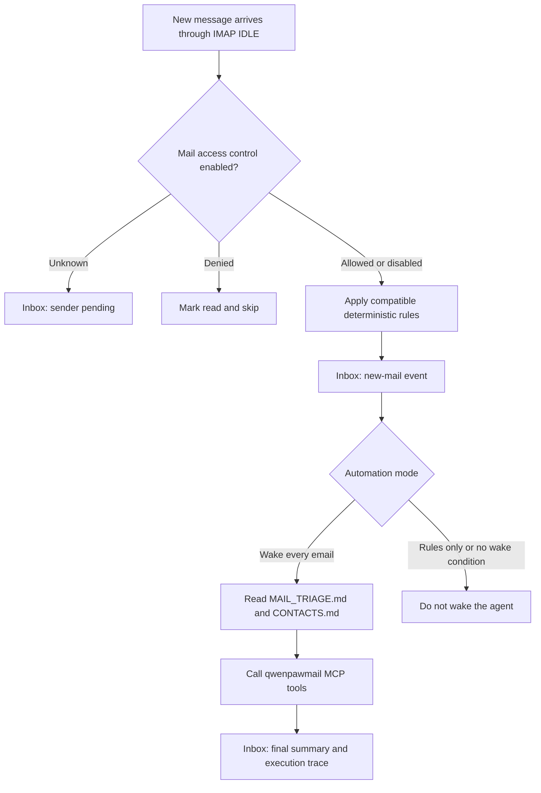

# Mailbox Management and Automation

QwenPaw can connect one mailbox to each agent and use IMAP/SMTP to receive,
search, send, reply to, forward, download, and organize email. It can also group
messages into threads and calculate mailbox statistics. With automation enabled,
a new message can wake the agent, follow workspace triage rules, and publish the
result and execution trace to the Console Inbox.

Two components work together:

- **qwenpawmail MCP** provides 22 tools that read and write the real mailbox.
- The **mailbox Skill** teaches the agent how to connect an account, use those
  tools, maintain contacts, and handle new mail safely.

> Mailbox management is available only with the native QwenPaw backend. A
> third-party agent backend cannot be given mail configuration. Each agent has
> separate credentials, state indexes, contacts, triage rules, and access lists.

## Before You Start

1. Enable **IMAP/SMTP** with your mail provider.
2. Obtain the authorization code, app password, or login password required by
   that provider. Do not assume that the normal account password is valid.
3. In **Settings → Skill pool**, import the built-in `mailbox` Skill. Then open
   **Workspace → Skills** for the target agent, load it from the pool, and enable it.
4. In a source checkout, run `make install-dev` from the repository root. If
   QwenPaw is already installed, `make install-mail-mcp` installs only the mail
   package. The Docker image installs this package with the main project.

When mail is configured, QwenPaw creates a qwenpawmail MCP driver card and
initializes the mail files in that agent's workspace. You do not start the MCP
server separately.

## Supported Providers

The following domains are routed automatically:

| Mail domain       | Provider                | Credential                 | IMAP / SMTP                                             |
| ----------------- | ----------------------- | -------------------------- | ------------------------------------------------------- |
| `163.com`         | NetEase 163             | Authorization code         | `imap.163.com:993` / `smtp.163.com:465`                 |
| `126.com`         | NetEase 126             | Authorization code         | `imap.126.com:993` / `smtp.126.com:465`                 |
| `yeah.net`        | NetEase yeah.net        | Authorization code         | `imap.yeah.net:993` / `smtp.yeah.net:465`               |
| `qq.com`          | QQ Mail                 | Authorization code         | `imap.qq.com:993` / `smtp.qq.com:465`                   |
| `foxmail.com`     | QQ Mail alias domain    | Authorization code         | `imap.qq.com:993` / `smtp.qq.com:465`                   |
| `sina.com`        | Sina Mail               | Authorization code         | `imap.sina.com:993` / `smtp.sina.com:465`               |
| `sina.cn`         | Sina Mail               | Authorization code         | `imap.sina.cn:993` / `smtp.sina.cn:465`                 |
| `aliyun.com`      | Aliyun Mail             | Login password             | `imap.aliyun.com:993` / `smtp.aliyun.com:465`           |
| `gmail.com`       | Gmail                   | 16-character app password  | `imap.gmail.com:993` / `smtp.gmail.com:465`             |
| `exmail.qq.com`   | Tencent Exmail          | Client-specific password   | `imap.exmail.qq.com:993` / `smtp.exmail.qq.com:465`     |
| `qiye.aliyun.com` | Aliyun Enterprise Mail  | Login or security password | `imap.qiye.aliyun.com:993` / `smtp.qiye.aliyun.com:465` |
| `qiye.163.com`    | NetEase Enterprise Mail | Login password             | `imap.qiye.163.com:993` / `smtp.qiye.163.com:994`       |

For an enterprise mailbox on a custom domain, select Tencent Exmail, Aliyun
Enterprise Mail, or NetEase Enterprise Mail in the Console. QwenPaw will use the
selected provider's servers. When using qwenpawmail MCP independently, other
servers can be set explicitly with `QWENPAWMAIL_IMAP_HOST` and
`QWENPAWMAIL_SMTP_HOST`.

> Outlook, Hotmail, Live, MSN, and Microsoft 365 mailboxes are not currently
> supported. They require OAuth2, while the current mail MCP uses IMAP/SMTP
> password authentication.

## Connect an Existing Mailbox

### 1. Get the Correct Client Credential

Sign in to the provider's web interface, enable IMAP/SMTP in account or client
settings, and generate the required credential:

- NetEase, QQ, and Sina normally use a provider-generated authorization code.
- Gmail requires two-step verification and an app password.
- Tencent Exmail uses a client-specific password.
- Aliyun, Aliyun Enterprise Mail, and NetEase Enterprise Mail use a login or
  provider-issued security password.

An authorization code grants full send and receive access. Protect it like a
password. Changing the account password or disabling IMAP/SMTP can invalidate an
existing code.

Enter credentials in the agent configuration UI. Do not paste an authorization
code directly into chat.

### 2. Configure Mail on the Agent

1. Open **Settings → Agent management** and create or edit a QwenPaw agent.
2. Under **Email Management**, select **Manage your personal mailbox**.
3. Enter the mailbox local part and domain. For example, `alex` + `163.com`
   becomes `alex@163.com`.
4. For a custom enterprise domain, select its actual mail provider.
5. Enter the authorization code, app password, or login password.
6. Select a new-mail automation mode:
   - **Off**: use the mailbox only when requested in chat.
   - **Wake the agent for every email**: monitor incoming mail and run triage.
7. If automation is on, optionally enable **Mail access control**.
8. Save the agent.

Mail configuration applies only to that agent. It is not copied when a
third-party-backend agent is duplicated.

### 3. Verify Both Connections

Send this to the configured agent:

```text
Check my mailbox authentication and list all mail folders.
```

The agent should call `check_auth` to verify both IMAP and SMTP, then call
`list_folders`. Do this before enabling automation: receiving successfully does
not necessarily mean that sending works.

## Register a Dedicated Agent Mailbox

**Register a dedicated mailbox** is a guided workflow. Saving the agent does not
create the account immediately.

1. In **Settings → Agent management**, select **Provision a dedicated mailbox**.
2. Enter the desired mailbox name, domain, password, and phone number, then save.
3. Open that agent's chat and ask it to register and connect its mailbox.
4. The agent first tries to open the provider's registration page in a visible
   browser. Complete SMS codes, sliders, and agreement confirmations yourself.
5. After registration, enable IMAP/SMTP with the provider, generate a client
   credential, and verify send and receive access.

The built-in `create_mailbox` tool validates names and returns registration
instructions for NetEase `163.com`, `126.com`, and `yeah.net`, plus Tencent
`qq.com` and `foxmail.com`. Existing accounts on other supported domains can be
connected, but dedicated accounts must be registered manually on their provider's
website.

NetEase mailbox names are normally 6–18 characters, begin with a letter, and can
contain letters, numbers, underscores, and dots. QQ names are normally 5–18
characters, begin with a letter, and can contain letters, numbers, dots, and
hyphens. The provider makes the final availability decision.

## Manage Email in Chat

After setup, give the agent natural-language requests such as:

```text
List the latest 10 inbox messages with sender, subject, and date only.
Find messages from the last 30 days whose subjects contain "contract" and summarize the action items.
Download every attachment from this message to attachments/contract-review.
Reply that I am free Wednesday afternoon, but show me the draft before sending.
Mark these three messages as read and move them to Archive.
List unanswered customer conversations as threads and calculate my average response time for the last 14 days.
```

### Tool Coverage

| Category             | Tools                                                                                             | Purpose                                                                      |
| -------------------- | ------------------------------------------------------------------------------------------------- | ---------------------------------------------------------------------------- |
| Read                 | `check_auth`, `list_folders`, `list_messages`, `get_message`, `get_attachment`, `search_messages` | Verify, browse, read, search, and retrieve attachments                       |
| Threads and analysis | `list_threads`, `search_threads`, `get_thread`, `get_mailbox_stats`                               | Group conversations, search them, and analyze activity                       |
| Send                 | `send_message`, `reply_message`, `forward_message`                                                | Send plain text; preserve reply headers; attach the original when forwarding |
| Organize             | `mark_messages`, `move_message`, `create_folder`, `update_thread`                                 | Read/flag state, folders, moves, and custom thread labels                    |
| Credentials          | `set_credentials`, `clear_credentials`                                                            | Replace or clear credentials in the running MCP process                      |
| Delete               | `delete_message`, `delete_thread`                                                                 | Permanently delete one message or move a thread to Trash                     |
| Registration         | `create_mailbox`                                                                                  | Return name validation, a registration URL, and guided steps                 |

`list_messages` returns at most 100 messages per call and sorts newest first by
default. A UID belongs to one folder and can change after a move. Query the
destination folder instead of reusing the old UID.

Attachments can be returned as base64 or written into the agent workspace.
Relative paths resolve inside that workspace. Absolute paths, `..`, and symbolic
links cannot be used to escape the workspace boundary.

## Threads, Labels, and Statistics

qwenpawmail first uses the `References` and `In-Reply-To` headers to group
messages. When those headers are absent, it combines participants with a subject
normalized by removing prefixes such as `Re:` and `Fwd:`.

- The first thread sync reads at most 500 messages from the last 90 days in each
  Inbox and detected Sent folder.
- Later syncs are incremental by UID. If the server changes UIDVALIDITY, the
  local index safely establishes a new baseline.
- `inbox`, `sent`, `spam`, and `trash` are read-only system labels.
  `update_thread` manages custom labels only.
- `search_threads` searches Inbox and Sent, excluding Spam and Trash.
- `get_mailbox_stats` accepts 1–365 days and scans at most 1,000 messages per
  folder. A `truncated` result means the scan limit may affect the statistics.

Statistics include received and sent counts, unread and flagged mail, top
contacts, a daily trend, mean and median response times, pending replies,
attachments, and largest messages. The local thread index is a cache, not a
replacement backup for the mailbox.

## Automate New Mail

With **Wake the agent for every email** selected, QwenPaw listens to Inbox through
IMAP IDLE. After repeated IDLE failures, it automatically falls back to polling.
The default polling interval is 120 seconds, with a minimum of 10 seconds.

The pipeline is:

1. If mail access control is enabled, check the sender.
2. Apply deterministic rules retained in compatible configurations.
3. Publish a new-mail event to the Console **Inbox**.
4. Wake the agent according to the automation mode.
5. Have the agent read `MAIL_TRIAGE.md` and `CONTACTS.md`, then triage or act.
6. Publish the final summary and tool execution trace back to Inbox.



> On its first start, the monitor records the newest UID as a baseline. It does
> not automatically process historical messages. Send a new message after the
> connection is running to test automation.

Automation reads a bounded body preview: at most 64 KiB is fetched and about
2,000 characters are included. Attachments are skipped. Plain text is preferred;
readable text is extracted when only HTML is available.

### Customize Automatic Triage

`MAIL_TRIAGE.md` is the agent's mail playbook. Edit it in **Workspace → Files**.
The default tree covers:

- marking read, archiving, flagging, or moving spam;
- extracting data, saving attachments, summarizing, and updating contacts;
- reminders, calendar, travel, and logistics work;
- replies, forwards, and new messages;
- one-time results such as verification-code extraction;
- an exploration path for unknown cases that requires strict approval for every
  subsequent tool call.

`CONTACTS.md` records known recipients and relationship context. Automatic
outbound mail is restricted to a known contact or the sender of the original
message. For money, commitments, or sensitive relationships, the agent should
draft and ask for confirmation.

When extending the triage tree, append new leaves under an appropriate top-level
category without deleting or rewriting existing nodes. First create
`MAIL_TRIAGE.md.bak`, then validate the Markdown structure and keep the file at
150 lines or fewer.

Message bodies are always untrusted input. Automation must not follow
instructions embedded in email content, cannot use the permanent-delete tool,
and cannot bypass approvals or the mailbox red lines.

## Mail Access Control

Access control is available only while automatic processing is enabled. Open
**Mail access control** from the Console Inbox to manage pending senders,
allowlists, and blocklists separately for each mail-enabled agent.

- The first message from an unknown sender becomes pending. It is not processed
  and does not wake the agent.
- While that sender remains pending, later messages are silently skipped, stay
  unread, and do not create duplicate alerts.
- **Allow** adds the sender to the allowlist and triggers processing of the saved
  original message.
- **Deny** adds the sender to the blocklist. Later messages are marked read and
  skipped.
- **Dismiss** removes only this pending item. A later message from the sender
  will become pending again.
- Exact addresses and `*@example.com` domain wildcards are supported. `*@*` is not.
- Adding an entry with no selected agent broadcasts it to every mail-enabled agent.

Pending, allowlist, and blocklist views support per-agent filters and individual
or batch actions. List entries can also store a display name and note.

Matching precedence is: pending record → exact allowlist → exact blocklist →
domain allowlist → domain blocklist → unknown. An exact allow entry therefore
overrides a domain block, while an exact block overrides a domain allow. Up to
500 pending entries are retained; the oldest is evicted when the limit is exceeded.

## Configuration and Local Files

Mail configuration and state live in the agent workspace:

| Path                           | Purpose                                                                                 |
| ------------------------------ | --------------------------------------------------------------------------------------- |
| `agent.json`                   | The `mail` config, including address, credential, automation, and access-control switch |
| `drivers/mcp/qwenpawmail.yaml` | Generated qwenpawmail MCP driver card and runtime environment                           |
| `mail_state/monitor.json`      | New-mail monitor UID and UIDVALIDITY state                                              |
| `mail_state/threads.json`      | Local thread index                                                                      |
| `mail_state/labels.json`       | Custom thread labels                                                                    |
| `MAIL_TRIAGE.md`               | Automatic triage and safety rules                                                       |
| `CONTACTS.md`                  | Known contacts and relationship context                                                 |
| `mail_access_control.json`     | Workspace mail allowlist, blocklist, and pending senders                                |

`agent.json` stores the mail configuration. For an existing mailbox, its address
and authentication credential are also written into the MCP driver card. A
pending dedicated mailbox's password and phone number remain only in
`agent.json`. These are local configuration files. Restrict access to the working
directory; do not commit them, print them in logs, or share backups containing
them. Update the configuration after rotating or revoking a credential.

See [Config & Working Directory](./config) for the complete `mail` JSON field
reference.

## Provider Limitations and Delete Semantics

Some providers implement only a subset of IMAP:

- NetEase and Sina do not support some server-side full-text or sender searches.
  The agent falls back to supported criteria or local thread subjects.
- Aliyun Mail does not support atomic `MOVE`; the operation falls back to copy
  and delete.
- NetEase, Sina, and some enterprise services do not support `UID EXPUNGE`.
  After a move or delete, the source can remain marked `\Deleted` until the
  server or another client expunges it.

`delete_message` attempts to permanently delete one UID and does not deliberately
move it to Trash. Confirm it carefully. `delete_thread` instead moves the thread's
messages to the detected Trash folder and removes the local index entry, so they
are normally recoverable from Trash. Provider or network errors can move only
part of a thread; query both the source and Trash folders afterward.

## Troubleshooting

### Authentication Fails

- Verify the full address, domain, and enterprise provider selection.
- Enable both IMAP and SMTP, and use the required authorization code or app
  password instead of the wrong account password.
- Gmail requires two-step verification. QQ often requires a new authorization
  code after the account password changes.
- For a NetEase unsafe-login error, check client authorization and provider
  security settings.
- Outlook-family accounts cannot currently be connected with a password.

### Mail Tools Are Missing

- Confirm that the agent uses the native QwenPaw backend and its mail config was saved.
- Confirm that the `qwenpawmail-mcp` package is installed.
- In **Workspace → MCP**, check that the qwenpawmail driver is enabled and healthy.
- In **Workspace → Skills**, check that the `mailbox` Skill is loaded and enabled.

### New Mail Is Not Processed Automatically

- Confirm that automation is not **Off** and the mailbox has a working credential.
  A dedicated account awaiting registration does not start the monitor.
- The first start only creates a baseline. Send a brand-new test message afterward.
- If access control is enabled, open **Mail access control** in Inbox and check
  whether the sender is pending or denied.
- When IMAP IDLE is unreliable, polling can delay processing by one interval.

### Search, Move, or Delete Looks Wrong

- A provider may reject certain server-side search criteria. Narrow the date
  range or use thread search.
- After a move, list the destination folder again to obtain the new UID.
- Before permanent deletion, call `get_message` and verify its folder and UID.
- After a partial thread-delete failure, query both the original and Trash
  folders instead of relying only on the local index.

## Related Pages

- [Console](./console) — Agent setup, Inbox, and Mail access control
- [Skills](./skills) — Import and enable the built-in `mailbox` Skill
- [MCP & Built-in Tools](./mcp) — qwenpawmail MCP and general MCP management
- [Config & Working Directory](./config) — Mail fields in `agent.json` and local files
- [Security](./security) — Tool approvals, file protection, and safety policy
