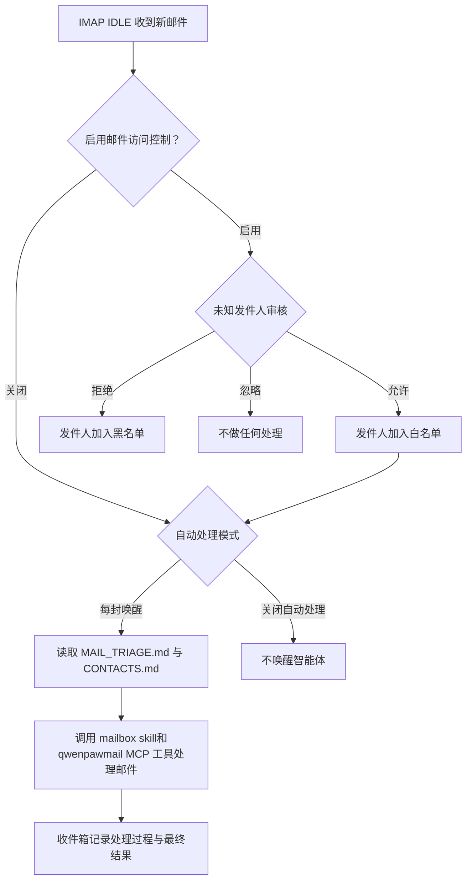

# 邮箱管理与自动化

QwenPaw 可以让每个智能体连接一个邮箱，通过 IMAP/SMTP 完成收信、搜索、发信、
回复、转发、附件处理、邮件整理和统计分析等。启用新邮件自动响应后，智能体会自动对
邮箱中的新邮件进行智能化处理，还会根据用户习惯随时改进和学习新场景下的邮件处理能力，
逐步实现用户邮箱全托管。

QwenPaw 的邮箱管理能力由两部分协同完成：

- **Qwenpawmail MCP** 提供 22 个邮箱工具，负责可靠地读写真实邮箱。
- **Mailbox Skill** 告诉智能体如何连接账户、使用工具、维护联系人和安全地处理新邮件。

> 邮箱管理仅支持 QwenPaw 原生后端。第三方智能体后端目前不能配置邮箱。
> 每个智能体拥有独立的邮箱配置、联系人和访问控制名单。

## 快速使用
1. 安装 QwenPaw 环境依赖时会同步安装 Qwenpawmail MCP 的环境。
2. 如需使用源码开发环境，需要在仓库根目录运行 `make install-dev`；如果 QwenPaw 已安装，只需补装
   邮箱子包，可运行 `make install-mail-mcp`。Docker 镜像会随主项目安装该子包。
3. 配置邮箱时，确认邮箱服务商已启用 **IMAP/SMTP**，并准备邮箱服务商提供的授权码、应用专用密码或登录密码。
   不要把普通登录密码误当成授权码。
4. 配置邮箱后，QwenPaw 会为该智能体创建 qwenpawmail MCP 驱动卡（你不需要另行启动 MCP server。），并初始化邮箱相关的工作区文件。
   如果你过去使用过QwenPaw，你需要在**技能池** 中更新内置技能，确保QwenPaw原生的 `mailbox` Skill替换掉了 `himalaya` 出现在技能池中。

## 支持的邮箱服务商

以下域名会自动选择服务器：

| 邮箱域名          | 服务商        | 所需凭据           | IMAP / SMTP                                             |
| ----------------- | ------------- | ------------------ | ------------------------------------------------------- |
| `163.com`         | 网易 163      | 授权码             | `imap.163.com:993` / `smtp.163.com:465`                 |
| `126.com`         | 网易 126      | 授权码             | `imap.126.com:993` / `smtp.126.com:465`                 |
| `yeah.net`        | 网易 yeah.net | 授权码             | `imap.yeah.net:993` / `smtp.yeah.net:465`               |
| `qq.com`          | QQ 邮箱       | 授权码             | `imap.qq.com:993` / `smtp.qq.com:465`                   |
| `foxmail.com`     | QQ 邮箱别名域 | 授权码             | `imap.qq.com:993` / `smtp.qq.com:465`                   |
| `sina.com`        | 新浪邮箱      | 授权码             | `imap.sina.com:993` / `smtp.sina.com:465`               |
| `sina.cn`         | 新浪邮箱      | 授权码             | `imap.sina.cn:993` / `smtp.sina.cn:465`                 |
| `aliyun.com`      | 阿里邮箱      | 登录密码           | `imap.aliyun.com:993` / `smtp.aliyun.com:465`           |
| `gmail.com`       | Gmail         | 16 位应用专用密码  | `imap.gmail.com:993` / `smtp.gmail.com:465`             |

如果你想在其他地方独立使用 qwenpawmail MCP 时，也可以通过
`QWENPAWMAIL_IMAP_HOST` 和 `QWENPAWMAIL_SMTP_HOST` 显式接入其他服务器。

> 企业邮箱、Outlook、Hotmail、Live、MSN 和 Microsoft 365 邮箱当前不受支持。

## 支持的邮箱操作（共 22 个工具，分三类）
### 只读（11 个）

| 工具 | 说明 |
| --- | --- |
| `check_auth` | 验证 IMAP 和 SMTP 均可成功登录（建议首次先调用） |
| `list_folders` | 列出全部文件夹（中文名自动从 modified UTF-7 解码） |
| `list_messages` | 分页列出邮件信封元数据（folder / limit ≤ 100 / offset，不拉取正文） |
| `get_message` | 按 UID 获取单封邮件的 text/html 正文与附件元数据 |
| `get_attachment` | 按文件名或序号下载附件（base64 返回或保存到磁盘） |
| `search_messages` | 按关键词、发件人和/或日期范围搜索 |
| `create_mailbox` | 新邮箱注册引导：校验用户名、生成备选名、返回注册链接与分步指引 |
| `list_threads` | 按标签/发件人/收件人/主题/日期过滤会话线程，按最新消息时间倒序 |
| `search_threads` | INBOX + 已发送全文搜索并映射到线程，按命中数 + 新近度排序 |
| `get_thread` | 获取线程内全部消息 envelope（时间正序） |
| `get_mailbox_stats` | 近 N 天邮箱洞察：收发量、top 发件人/收件人、每日趋势、响应时长、待回复邮件、附件统计 |

### 写操作（9 个）

| 工具 | 说明 |
| --- | --- |
| `send_message` | 发送纯文本邮件（to/cc/bcc/subject/body） |
| `reply_message` | 回复邮件（自动 In-Reply-To/References 头与 `Re:` 前缀） |
| `forward_message` | 转发邮件（原信作为 rfc822 附件，`Fwd:` 前缀） |
| `mark_messages` | 批量标记已读/未读/星标/取消星标 |
| `move_message` | 移动邮件到其他文件夹 |
| `create_folder` | 新建文件夹（中文名自动编码为 modified UTF-7） |
| `set_credentials` | 运行时设置/更新邮箱凭据（覆盖 env；未知域名需同时提供 imap_host/smtp_host） |
| `clear_credentials` | 清除运行时凭据（如设置了 env 则回退到 env） |
| `update_thread` | 为线程添加/移除自定义标签（系统标签 `inbox`/`sent`/`spam`/`trash` 只读） |

### 破坏性操作（2 个）

| 工具 | 说明 |
| --- | --- |
| `delete_message` | 将邮件标记为 `\Deleted`，并在服务商支持时用 RFC 4315 UID EXPUNGE 立即清理；始终仅作用于指定 UID，绝不使用全局 EXPUNGE |
| `delete_thread` | 将线程内所有消息移入已删除文件夹并从索引中移除线程 |

> `list_messages` 每次最多返回 100 封，并默认按时间倒序。邮件 UID 只在对应文件夹中有效；
> 移动邮件后，应重新查询目标文件夹，而不要继续使用旧 UID。

> 附件可以作为 base64 返回，也可以保存到智能体工作区。相对路径会从工作区解析；绝对路径、
> `..` 路径和符号链接都不能绕过工作区边界。

## 连接你的个人邮箱

### 1. 获取正确的客户端凭据

先登录对应邮箱的网页版，在账户或客户端设置中启用 IMAP/SMTP，并生成所需凭据：

- 网易、QQ 和新浪邮箱通常使用服务商生成的授权码。
- 阿里邮箱使用登录密码或服务商提供的安全密码。
- Gmail 需要先在Google中开启两步验证，再生成应用专用密码。

> 注意：授权码拥有完整的收发信权限，应像密码一样保管，并尽量在智能体配置界面中填写凭据，
> 不要把授权码直接发送到聊天中。修改账户密码或关闭 IMAP/SMTP 后，已有授权码也可能失效。

### 2. 在智能体上配置邮箱

1. 打开 **智能体管理**，创建或编辑一个 QwenPaw 智能体。
2. 在 **邮箱管理** 中选择 **管理你的个人邮箱**。
3. 输入邮箱名前缀和域名。例如 `alex` + `163.com` 对应 `alex@163.com`。
5. 填入授权码、应用专用密码或登录密码。
6. 选择新邮件自动处理方式：
   - **关闭**：只在对话中按需操作邮箱，不会对新邮件做监控和自动处理。
   - **每封唤醒**：监控新邮件并由智能体自主决策处理。
7. 自动处理开启后，可按需启用 **邮件访问控制**。开启后，未知发件人的邮件需审批后才会被处理。
8. 保存智能体。

> 邮箱配置仅对当前智能体生效。复制第三方后端智能体时，邮箱配置不会被复制。

### 3. 验证连接

在该智能体的聊天会话中发送：

```text
检查我的邮箱认证是否正常，并列出邮箱文件夹。
```

智能体会调用 `check_auth` 同时验证 IMAP 和 SMTP，然后调用 `list_folders`。建议在开始
自动处理前完成这一步，因为“能收信”不一定代表“能发信”。

## 为智能体注册专用邮箱

**注册专用邮箱** 是一个引导流程，受各邮箱服务商管控原因不会在保存智能体时立即创建账户。

1. 在 **智能体管理** 中选择 **为智能体配备专属邮箱**。
2. 按需填写期望的邮箱名和域名后缀，如注册前不填写会按照对应邮箱的命名规则随机生成。
3. 保存智能体配置后打开该智能体的聊天，请它“为自己注册并连接专用邮箱”。
4. 智能体会优先使用可见浏览器打开服务商注册页面。遇到短信验证码、滑块或协议确认时，
   由你完成必要的人工步骤。
5. 注册完成后，在服务商设置中启用 IMAP/SMTP 并生成授权码，再验证收发信连接。
6. 重新打开智能体配置，填写最终的邮箱名和 16 位授权码/应用专用密码，最后保存设置。
7. QwenPaw 会自动将 is_new_account 设为 false、加密保存 secret、同步托管 DriverCard 并重载智能体。

> 内置的 `create_mailbox` 工具可校验名称并提供注册指引，适用于网易
> `163.com`、`126.com`、`yeah.net` 以及腾讯 `qq.com`、`foxmail.com`。其他已支持域名可以
> 连接现有账户，但专用邮箱需要在相应服务商网站手动注册。

## 在聊天对话中管理邮箱

配置完成后，可以直接用自然语言下达任务。例如：

```text
列出收件箱最新 10 封邮件，只显示发件人、主题和时间。
搜索最近 30 天主题含“合同”的邮件，并总结待办事项。
下载这封邮件的全部附件到 attachments/contract-review。
回复这封邮件，说明我周三下午有空；发送前先给我看草稿。
把这三封邮件标为已读并移动到 Archive。
按会话列出未回复的客户邮件，并统计最近 14 天的平均响应时间。
```

## 自动化实时处理新邮件

选择 **每封唤醒** 后，QwenPaw 会用 IMAP IDLE 监听收件箱；连续失败时自动降级为
定时轮询。默认轮询间隔为 120 秒，最小为 10 秒。

处理流程如下：

1. 如果启用了邮件访问控制，先检查发件人。
2. 执行兼容配置中的确定性规则。
3. 把新邮件事件写入控制台 **收件箱**。
4. 根据自动处理模式唤醒智能体。
5. 智能体读取 `MAIL_TRIAGE.md` 和 `CONTACTS.md`，执行分类、整理或沟通任务。
6. 最终摘要和工具执行轨迹写回收件箱。



> 监控器第一次启动时只记录当前最新 UID 作为基线，不会自动处理历史邮件。

自动流程只读取受限的正文预览：单封最多获取 64 KiB，并截取约 2000 个字符；附件不会被
当作正文读取。纯文本优先，只有 HTML 时会提取可读文字。

### 智能体邮件处理规则和流程
1. 智能体被唤醒后，会先参考 `MAIL_TRIAGE.md` 和 `CONTACTS.md` 再生成邮件管理策略。
其中：
`MAIL_TRIAGE.md` 是智能体的邮件分流手册，可以在 **工作区 → 文件** 中查看和编辑。默认策略覆盖：
- 标记已读、归档、星标或移入垃圾邮件等邮箱状态操作；
- 提取数据、保存附件、总结和维护联系人；
- 创建提醒、日程、旅行或物流事项；
- 回复、转发和新建邮件；
- 提取验证码等一次性结果；
- 无法归类时进入F1探索流程并对后续每个工具调用请求严格审批。

`CONTACTS.md` 保存已知联系人和关系上下文。自动发信只允许发给已知联系人或原邮件发件人；
涉及金钱、承诺或敏感关系时，智能体只应起草内容并请求确认。

2. 按分诊树自上而下匹配新邮件的「识别特征」，命中则按「前置工具链→终态动作」执行；复合场景按组合规则执行。
3. 全部未命中或命中置信度低时走 F 类，进入「F1 探索模式」：
   a. 代入收件人身份分析邮件意图，规划邮件处理流程
   b. 按照规划逐步调用工具执行，每步工具调用前生成调用申请"
   c. 此时，每个邮件操作工具（回复/转发/移动/标记等）都会自动请求用户审批，用户可以看到智能体的申请并决定
      - 同意 → 工具正常执行
      - 拒绝 → 工具被阻止并返回拒绝信息，智能体会换一种思路重新尝试
   d. 连续 3 次被拒绝或确实无可行方案则在最终输出中说明情况并请示用户
4. F1 探索成功后，回顾整个处理过程：
   a. 总结此类邮件的通用处理做法（识别特征+推荐工具链+终态动作）
   b. 追加到 `MAIL_TRIAGE.md` 中，实现持续的新场景和用户偏好学习
5. 如果回复了邮件，结合本次往来更新 `CONTACTS.md` 中的联系人列表。

## 邮件访问控制

访问控制仅在自动处理已开启时可用，用于审批未知发件人的邮件以及对发件人进行加白/加黑。
打开控制台收件箱中的 **邮件管控**，即可管理每个邮箱智能体的待审批发件人、白名单和黑名单。
待处理、白名单和黑名单都支持按智能体筛选以及单条或批量操作；名单条目还可以记录显示名
和备注。

### 未知发件人邮件审批
开启访问控制后，收到不在发件人名单中的未知发件人的邮件时，该邮件会进入待审批发件人列表，
列表中可以看到收到邮件的智能体、发件人地址、发件人名称、邮件主题、正文预览、收件时间，
用户可以根据需求对其进行备注，并决定是否 **批准/拒绝/跳过** 该发件人的邮件。
   - **允许**：加入白名单，对此邮件触发一次智能体处理。
   - **拒绝**：加入黑名单，将此邮件被标为已读并跳过。
   - **忽略**：只移除本次待处理记录，此人下次来信仍会重新进入待处理。
待处理列表最多保留 500 条，超出时移除最旧记录。
> 未知发件人的第一封邮件进入待审批列表，智能体不会读取处理，也不会被唤醒。
> 发件人仍在待处理时，后续来信会静默跳过并保持未读，不会重复创建提醒。

### 发件人名单
发件人名单可以通过审批发件人和手动添加发件人来编辑。
   - **白名单**：后续来自同一发件地址的所有邮件直接放行并唤醒智能体处理，不再需要审批。
   - **黑名单**：后续来自同一发件地址的所有邮件被标为已读并跳过。

> 添加发件人时支持精确地址和 `*@example.com` 域名通配符，不支持 `*@*`。
> 添加发件人时需选择具体的智能体；若没有选择，则会把该条目广播到所有已启用邮箱的智能体。

## 配置与本地文件

邮箱配置和状态位于智能体工作区：

| 路径                           | 用途                                                    |
| ------------------------------ | ------------------------------------------------------- |
| `agent.json`                   | 保存邮箱地址、自动处理和访问控制开关 |
| `credentials.yaml`             | 保存邮箱隐私信息，包括授权码、密码等，智能体不可直接编辑 |
| `drivers/mcp/qwenpawmail.yaml` | 自动生成的 qwenpawmail MCP 驱动卡和运行环境             |
| `mail_state/monitor.json`      | 新邮件监控 UID 和 UIDVALIDITY 状态                      |
| `mail_state/threads.json`      | 本地线程索引                                            |
| `mail_state/labels.json`       | 自定义线程标签                                          |
| `MAIL_TRIAGE.md`               | 自动邮件分流与安全规则                                  |
| `CONTACTS.md`                  | 已知联系人和关系上下文                                  |
| `mail_access_control.json`     | 该工作区的邮件白名单、黑名单和待处理发件人              |

## 服务商差异与删除语义

部分服务商只实现了 IMAP 的子集：

- 网易和新浪不支持部分服务器端全文/发件人搜索，智能体会使用可用条件或本地线程主题降级。
- 阿里邮箱不支持原子 `MOVE`，移动操作会尝试复制后删除。
- 网易、新浪和部分企业邮不支持 `UID EXPUNGE`。移动或删除后，源邮件可能暂时保持
  `\Deleted` 状态，直到服务器或其他客户端执行清理。

`delete_message` 尝试永久删除指定 UID，不会主动移入垃圾箱；执行前务必确认。
`delete_thread` 的实际行为是把线程内邮件移入检测到的垃圾箱，然后移除本地线程索引，通常
仍可从垃圾箱恢复。服务商限制或网络错误可能导致线程只移动了一部分，应重新查询核对结果。

## 故障排查

### 认证失败

- 确认完整邮箱地址、域名和企业邮箱服务商选择正确。
- 确认 IMAP 和 SMTP 都已开启，使用的是授权码/应用专用密码而不是错误的账户密码。
- Gmail 需开启两步验证；QQ 修改账户密码后通常需要重新生成授权码。
- 网易若提示不安全登录，检查客户端授权和服务商安全设置。
- Outlook 系列邮箱当前不能用密码方式接入。

### 看不到邮箱工具

- 确认智能体使用 QwenPaw 原生后端并已保存邮箱配置。
- 确认已安装 `qwenpawmail-mcp` 子包。
- 在 **工作区 → MCP** 检查 qwenpawmail 驱动是否启用且健康。
- 在 **工作区 → 技能** 确认 `mailbox` Skill 已载入并启用。

### 没有自动处理新邮件

- 确认模式不是 **关闭**，而且已有可用凭据；待注册的专用邮箱不会启动监控。
- 第一次启动只建立基线，请在启动后发送一封全新的测试邮件。
- 开启访问控制时，到收件箱的 **邮件管控** 检查发件人是否待批准或已被拒绝。
- IMAP IDLE 不可靠时会自动轮询，结果可能延迟一个轮询周期。

### 搜索、移动或删除结果与预期不同

- 服务商可能不支持某些服务器端搜索条件，尝试缩小日期范围或改用线程搜索。
- 移动后重新列出目标文件夹以获取新 UID。
- 永久删除前先调用 `get_message` 核对文件夹和 UID。
- 线程删除发生部分失败时，重新查询原文件夹和垃圾箱，不要仅依赖本地索引。

## 相关页面

- [控制台](./console) — 智能体配置、收件箱和邮件管控入口
- [Skills](./skills) — 导入和启用内置 `mailbox` Skill
- [MCP 与内置工具](./mcp) — qwenpawmail MCP 与通用 MCP 管理
- [配置与工作目录](./config) — `agent.json` 邮箱字段和本地文件
- [安全](./security) — 工具审批、文件防护和安全策略
