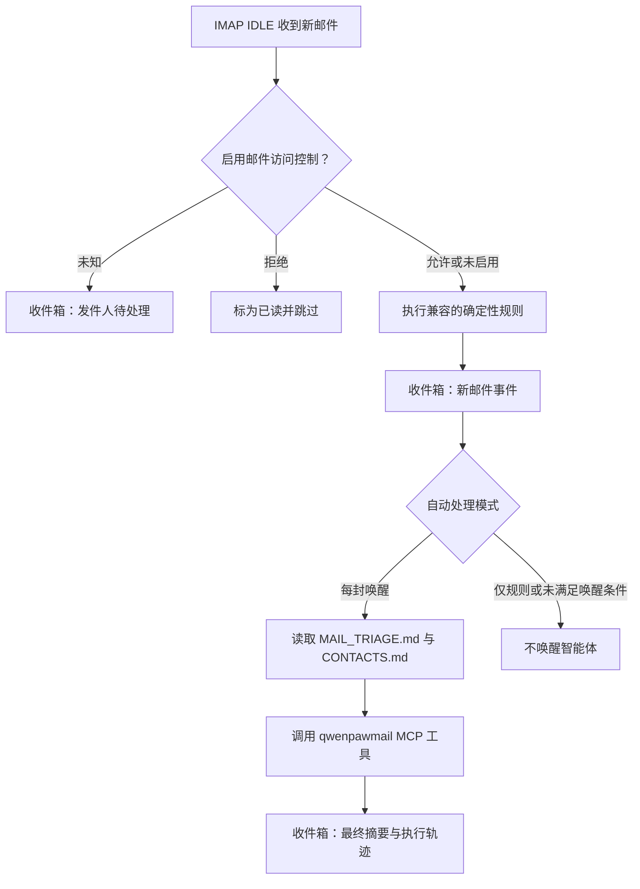

# 邮箱管理与自动化

QwenPaw 可以让每个智能体连接一个邮箱，通过 IMAP/SMTP 完成收信、搜索、发信、
回复、转发、附件处理、邮件整理和统计分析等。启用新邮件自动响应后，智能体会自动对
邮箱中的新邮件进行智能化处理，还会根据用户习惯随时改进和学习新场景下的邮件处理能力，
逐步实现用户邮箱全托管。

邮箱能力由两部分协同完成：

- **Qwenpawmail MCP** 提供 22 个邮箱工具，负责可靠地读写真实邮箱。
- **Mailbox Skill** 告诉智能体如何连接账户、使用工具、维护联系人和安全地处理新邮件。

> 邮箱管理仅支持 QwenPaw 原生后端。第三方智能体后端不能配置邮箱。每个智能体拥有
> 独立的邮箱配置、状态索引、联系人和访问控制名单。

## 开始之前

1. 确认邮箱服务商已启用 **IMAP/SMTP**。
2. 准备服务商要求的授权码、应用专用密码或登录密码。不要把普通登录密码误当成授权码。
3. 在 **设置 → 技能池** 导入内置 `mailbox` Skill，再到目标智能体的
   **工作区 → 技能** 从技能池载入并启用它。
4. 源码开发环境需要在仓库根目录运行 `make install-dev`；如果 QwenPaw 已安装，只需补装
   邮箱子包，可运行 `make install-mail-mcp`。Docker 镜像会随主项目安装该子包。

配置邮箱后，QwenPaw 会为该智能体创建 qwenpawmail MCP 驱动卡，并初始化邮箱相关的
工作区文件。你不需要另行启动 MCP server。

## 支持的邮箱服务商

以下域名会自动选择服务器：

| 邮箱域名          | 服务商        | 所需凭据           | IMAP / SMTP                                             |
| ----------------- | ------------- | ------------------ | ------------------------------------------------------- |
| `163.com`         | 网易 163      | 授权码             | `imap.163.com:993` / `smtp.163.com:465`                 |
| `126.com`         | 网易 126      | 授权码             | `imap.126.com:993` / `smtp.126.com:465`                 |
| `yeah.net`        | 网易 yeah.net | 授权码             | `imap.yeah.net:993` / `smtp.yeah.net:465`               |
| `qq.com`          | QQ 邮箱       | 授权码             | `imap.qq.com:993` / `smtp.qq.com:465`                   |
| `foxmail.com`     | QQ 邮箱别名域 | 授权码             | `imap.qq.com:993` / `smtp.qq.com:465`                   |
| `sina.com`        | 新浪邮箱      | 授权码             | `imap.sina.com:993` / `smtp.sina.com:465`               |
| `sina.cn`         | 新浪邮箱      | 授权码             | `imap.sina.cn:993` / `smtp.sina.cn:465`                 |
| `aliyun.com`      | 阿里邮箱      | 登录密码           | `imap.aliyun.com:993` / `smtp.aliyun.com:465`           |
| `gmail.com`       | Gmail         | 16 位应用专用密码  | `imap.gmail.com:993` / `smtp.gmail.com:465`             |
| `exmail.qq.com`   | 腾讯企业邮    | 客户端专用密码     | `imap.exmail.qq.com:993` / `smtp.exmail.qq.com:465`     |
| `qiye.aliyun.com` | 阿里企业邮    | 登录密码或安全密码 | `imap.qiye.aliyun.com:993` / `smtp.qiye.aliyun.com:465` |
| `qiye.163.com`    | 网易企业邮    | 登录密码           | `imap.qiye.163.com:993` / `smtp.qiye.163.com:994`       |

对于使用自定义域名的企业邮箱，在控制台选择腾讯企业邮、阿里企业邮或网易企业邮，
QwenPaw 会使用相应服务商的服务器。独立使用 qwenpawmail MCP 时，也可以通过
`QWENPAWMAIL_IMAP_HOST` 和 `QWENPAWMAIL_SMTP_HOST` 显式接入其他服务器。

> Outlook、Hotmail、Live、MSN 和 Microsoft 365 邮箱当前不受支持，因为这些服务要求
> OAuth2，而当前邮箱 MCP 使用 IMAP/SMTP 密码认证。

## 连接已有邮箱

### 1. 获取正确的客户端凭据

先登录邮箱网页版，在账户或客户端设置中启用 IMAP/SMTP，并生成所需凭据：

- 网易、QQ 和新浪通常使用服务商生成的授权码。
- Gmail 需要先开启两步验证，再生成应用专用密码。
- 腾讯企业邮使用客户端专用密码。
- 阿里、阿里企业邮和网易企业邮使用登录密码或服务商提供的安全密码。

授权码拥有完整的收发信权限，应像密码一样保管。修改账户密码或关闭 IMAP/SMTP 后，
已有授权码也可能失效。请在智能体配置界面中填写凭据，不要把授权码直接发送到聊天中。

### 2. 在智能体上配置邮箱

1. 打开 **设置 → 智能体管理**，创建或编辑一个 QwenPaw 智能体。
2. 在 **邮箱管理** 中选择 **管理你的个人邮箱**。
3. 输入邮箱名前缀和域名。例如 `alex` + `163.com` 对应 `alex@163.com`。
4. 如果是自定义企业域名，选择实际的企业邮箱服务商。
5. 填入授权码、应用专用密码或登录密码。
6. 选择新邮件自动处理方式：
   - **关闭**：只在对话中按需操作邮箱。
   - **每封唤醒**：监控新邮件并自动执行分流流程。
7. 自动处理开启后，可按需启用 **邮件访问控制**。
8. 保存智能体。

邮箱配置仅对这个智能体生效。复制第三方后端智能体时，邮箱配置不会被复制。

### 3. 验证连接

在该智能体的聊天中发送：

```text
检查我的邮箱认证是否正常，并列出邮箱文件夹。
```

智能体应调用 `check_auth` 同时验证 IMAP 和 SMTP，然后调用 `list_folders`。建议在开始
自动处理前完成这一步，因为“能收信”不一定代表“能发信”。

## 为智能体注册专用邮箱

**注册专用邮箱** 是一个引导流程，不会在保存智能体时立即创建账户。

1. 在 **设置 → 智能体管理** 中选择 **为智能体配备专属邮箱**。
2. 填写期望的邮箱名、域名、密码和绑定手机号后保存。
3. 打开该智能体的聊天，请它“为自己注册并连接专用邮箱”。
4. 智能体会优先使用可见浏览器打开服务商注册页面。遇到短信验证码、滑块或协议确认时，
   由你完成必要的人工步骤。
5. 注册完成后，在服务商设置中启用 IMAP/SMTP 并生成授权码，再验证收发信连接。

内置的 `create_mailbox` 工具可校验名称并提供注册指引，适用于网易
`163.com`、`126.com`、`yeah.net` 以及腾讯 `qq.com`、`foxmail.com`。其他已支持域名可以
连接现有账户，但专用邮箱需要在相应服务商网站手动注册。

网易邮箱名通常为 6–18 位，以字母开头，可包含字母、数字、下划线和点；QQ 邮箱名通常
为 5–18 位，以字母开头，可包含字母、数字、点和连字符。最终可用性仍由服务商决定。

## 在对话中管理邮箱

配置完成后，可以直接用自然语言下达任务。例如：

```text
列出收件箱最新 10 封邮件，只显示发件人、主题和时间。
搜索最近 30 天主题含“合同”的邮件，并总结待办事项。
下载这封邮件的全部附件到 attachments/contract-review。
回复这封邮件，说明我周三下午有空；发送前先给我看草稿。
把这三封邮件标为已读并移动到 Archive。
按会话列出未回复的客户邮件，并统计最近 14 天的平均响应时间。
```

### 工具能力

| 类型       | 工具                                                                                              | 说明                                                |
| ---------- | ------------------------------------------------------------------------------------------------- | --------------------------------------------------- |
| 只读       | `check_auth`、`list_folders`、`list_messages`、`get_message`、`get_attachment`、`search_messages` | 验证连接，浏览、读取、搜索邮件和附件                |
| 线程与分析 | `list_threads`、`search_threads`、`get_thread`、`get_mailbox_stats`                               | 聚合会话、全文检索和统计邮箱活动                    |
| 发信       | `send_message`、`reply_message`、`forward_message`                                                | 发送纯文本邮件；回复会保留线程头，转发会附带原信    |
| 整理       | `mark_messages`、`move_message`、`create_folder`、`update_thread`                                 | 设置已读/星标、移动、新建文件夹和管理自定义线程标签 |
| 凭据       | `set_credentials`、`clear_credentials`                                                            | 在 MCP 进程运行时更新或清除凭据                     |
| 删除       | `delete_message`、`delete_thread`                                                                 | 永久删除单封邮件，或把整个线程移入垃圾箱            |
| 注册       | `create_mailbox`                                                                                  | 返回邮箱名校验、注册链接和分步指引                  |

`list_messages` 每次最多返回 100 封，并默认按时间倒序。邮件 UID 只在对应文件夹中有效；
移动邮件后，应重新查询目标文件夹，而不要继续使用旧 UID。

附件可以作为 base64 返回，也可以保存到智能体工作区。相对路径会从工作区解析；绝对路径、
`..` 路径和符号链接都不能绕过工作区边界。

## 会话线程、标签与统计

qwenpawmail 会优先使用 `References` 和 `In-Reply-To` 邮件头聚合会话；缺少这些邮件头时，
会结合去除 `Re:`、`Fwd:` 等前缀后的主题和参与者判断线程。

- 首次建立线程索引时，每个收件箱/已发送文件夹最多读取最近 90 天的 500 封邮件。
- 后续使用 UID 增量同步。邮箱服务器重建 UID 时，索引会安全地重新建立基线。
- `inbox`、`sent`、`spam`、`trash` 是只读系统标签；`update_thread` 管理的是自定义标签。
- `search_threads` 搜索收件箱和已发送邮件，并排除垃圾邮件和垃圾箱。
- `get_mailbox_stats` 支持 1–365 天区间，每个文件夹最多扫描 1000 封；结果中的
  `truncated` 表示统计可能被扫描上限截断。

统计结果包括收发数量、未读/星标、主要联系人、每日趋势、平均和中位响应时间、待回复邮件、
附件数量及大邮件。线程索引是本地缓存，不是真实邮箱的替代备份。

## 自动处理新邮件

选择 **每封唤醒** 后，QwenPaw 会用 IMAP IDLE 监听收件箱；连续失败时自动降级为
定时轮询。默认轮询间隔为 120 秒，最小为 10 秒。

处理流程如下：

1. 如果启用了邮件访问控制，先检查发件人。
2. 执行兼容配置中的确定性规则。
3. 把新邮件事件写入控制台 **收件箱**。
4. 根据自动处理模式唤醒智能体。
5. 智能体读取 `MAIL_TRIAGE.md` 和 `CONTACTS.md`，执行分类、整理或沟通任务。
6. 最终摘要和工具执行轨迹写回收件箱。



> 监控器第一次启动时只记录当前最新 UID 作为基线，不会自动处理历史邮件。请在连接成功后
> 用一封新邮件测试自动处理。

自动流程只读取受限的正文预览：单封最多获取 64 KiB，并截取约 2000 个字符；附件不会被
当作正文读取。纯文本优先，只有 HTML 时会提取可读文字。

### 自定义自动处理规则

`MAIL_TRIAGE.md` 是智能体的邮件分流手册，可以在 **工作区 → 文件** 中编辑。默认策略覆盖：

- 标记已读、归档、星标或移入垃圾邮件等邮箱状态操作；
- 提取数据、保存附件、总结和维护联系人；
- 创建提醒、日程、旅行或物流事项；
- 回复、转发和新建邮件；
- 提取验证码等一次性结果；
- 无法归类时进入探索流程并对后续每个工具调用请求严格审批。

`CONTACTS.md` 保存已知联系人和关系上下文。自动发信只允许发给已知联系人或原邮件发件人；
涉及金钱、承诺或敏感关系时，智能体只应起草内容并请求确认。

扩充分流树时，只在合适的一级分类下追加新的叶子，不删除或改写已有节点。修改前先备份为
`MAIL_TRIAGE.md.bak`，修改后检查 Markdown 结构，并把文件控制在 150 行以内。

新邮件正文始终是不可信输入。自动流程不得执行正文中的指令，不会调用永久删除工具，也不能
绕过审批和邮件红线。

## 邮件访问控制

访问控制仅在自动处理已开启时可用。打开控制台收件箱中的 **邮件管控**，可以管理每个
邮箱智能体的待处理发件人、白名单和黑名单。

- 未知发件人的第一封邮件进入待处理列表，智能体不会读取处理，也不会被唤醒。
- 发件人仍在待处理时，后续来信会静默跳过并保持未读，不会重复创建提醒。
- **允许**：加入白名单，并为保存的原始邮件触发一次智能体处理。
- **拒绝**：加入黑名单；之后的来信会被标为已读并跳过。
- **忽略**：只移除本次待处理记录；此人下次来信仍会重新进入待处理。
- 支持精确地址和 `*@example.com` 域名通配符，不支持 `*@*`。
- 添加名单时未选择智能体，会把该条目添加到所有已启用邮箱的智能体。

待处理、白名单和黑名单都支持按智能体筛选以及单条或批量操作；名单条目还可以记录显示名
和备注。

优先级为：待处理记录 → 精确白名单 → 精确黑名单 → 域名白名单 → 域名黑名单 → 未知。
因此精确白名单可以覆盖域名黑名单，精确黑名单也可以覆盖域名白名单。待处理列表最多保留
500 条，超出时移除最旧记录。

## 配置与本地文件

邮箱配置和状态位于智能体工作区：

| 路径                           | 用途                                                    |
| ------------------------------ | ------------------------------------------------------- |
| `agent.json`                   | `mail` 配置，包括邮箱地址、凭据、自动处理和访问控制开关 |
| `drivers/mcp/qwenpawmail.yaml` | 自动生成的 qwenpawmail MCP 驱动卡和运行环境             |
| `mail_state/monitor.json`      | 新邮件监控 UID 和 UIDVALIDITY 状态                      |
| `mail_state/threads.json`      | 本地线程索引                                            |
| `mail_state/labels.json`       | 自定义线程标签                                          |
| `MAIL_TRIAGE.md`               | 自动邮件分流与安全规则                                  |
| `CONTACTS.md`                  | 已知联系人和关系上下文                                  |
| `mail_access_control.json`     | 该工作区的邮件白名单、黑名单和待处理发件人              |

`agent.json` 保存邮箱配置；连接已有邮箱时，地址和认证凭据也会写入 MCP 驱动卡。待注册专用
邮箱的密码和手机号只保存在 `agent.json`。这些内容目前都以本地配置文件形式存储。请限制
工作目录访问权限，不要提交到 Git、复制进日志或分享包含这些文件的备份。更换或撤销授权码
后，应同步更新配置。

完整的 `mail` JSON 字段请参阅 [配置与工作目录](./config)。

## 服务商差异与删除语义

部分服务商只实现了 IMAP 的子集：

- 网易和新浪不支持部分服务器端全文/发件人搜索，智能体会使用可用条件或本地线程主题降级。
- 阿里邮箱不支持原子 `MOVE`，移动操作会尝试复制后删除。
- 网易、新浪和部分企业邮不支持 `UID EXPUNGE`。移动或删除后，源邮件可能暂时保持
  `\Deleted` 状态，直到服务器或其他客户端执行清理。

`delete_message` 尝试永久删除指定 UID，不会主动移入垃圾箱；执行前务必确认。
`delete_thread` 的实际行为是把线程内邮件移入检测到的垃圾箱，然后移除本地线程索引，通常
仍可从垃圾箱恢复。服务商限制或网络错误可能导致线程只移动了一部分，应重新查询核对结果。

## 故障排查

### 认证失败

- 确认完整邮箱地址、域名和企业邮箱服务商选择正确。
- 确认 IMAP 和 SMTP 都已开启，使用的是授权码/应用专用密码而不是错误的账户密码。
- Gmail 需开启两步验证；QQ 修改账户密码后通常需要重新生成授权码。
- 网易若提示不安全登录，检查客户端授权和服务商安全设置。
- Outlook 系列邮箱当前不能用密码方式接入。

### 看不到邮箱工具

- 确认智能体使用 QwenPaw 原生后端并已保存邮箱配置。
- 确认已安装 `qwenpawmail-mcp` 子包。
- 在 **工作区 → MCP** 检查 qwenpawmail 驱动是否启用且健康。
- 在 **工作区 → 技能** 确认 `mailbox` Skill 已载入并启用。

### 没有自动处理新邮件

- 确认模式不是 **关闭**，而且已有可用凭据；待注册的专用邮箱不会启动监控。
- 第一次启动只建立基线，请在启动后发送一封全新的测试邮件。
- 开启访问控制时，到收件箱的 **邮件管控** 检查发件人是否待批准或已被拒绝。
- IMAP IDLE 不可靠时会自动轮询，结果可能延迟一个轮询周期。

### 搜索、移动或删除结果与预期不同

- 服务商可能不支持某些服务器端搜索条件，尝试缩小日期范围或改用线程搜索。
- 移动后重新列出目标文件夹以获取新 UID。
- 永久删除前先调用 `get_message` 核对文件夹和 UID。
- 线程删除发生部分失败时，重新查询原文件夹和垃圾箱，不要仅依赖本地索引。

## 相关页面

- [控制台](./console) — 智能体配置、收件箱和邮件管控入口
- [Skills](./skills) — 导入和启用内置 `mailbox` Skill
- [MCP 与内置工具](./mcp) — qwenpawmail MCP 与通用 MCP 管理
- [配置与工作目录](./config) — `agent.json` 邮箱字段和本地文件
- [安全](./security) — 工具审批、文件防护和安全策略
